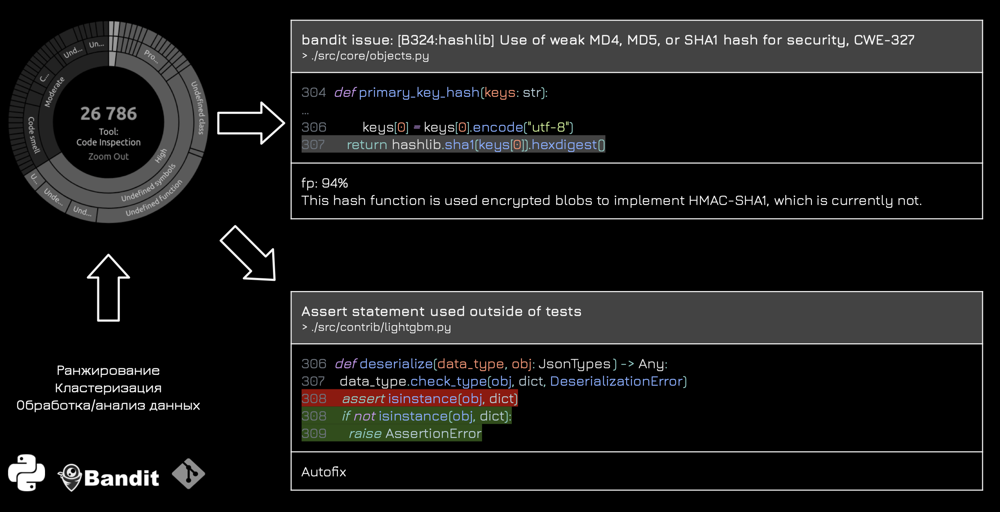

* ## Для разработчиков

    Ранжируем SAST отчеты по вероятности ложно-положительных (false positivie) ошибок

* ## Для безопасников

    Предлагаем исправления уязвимостей в коде (в процессе)

* ## Для руководителей

    Обогащаем результаты ошибок дополнительной информацией ошибок (в процессе)

----

# Пример прототипа

----

# [Написать письмо](mailto:babenkormn@gmail.com)
# [Написать в telegram](https://t.me/bblazee)
